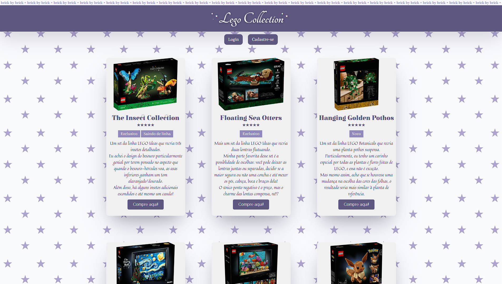
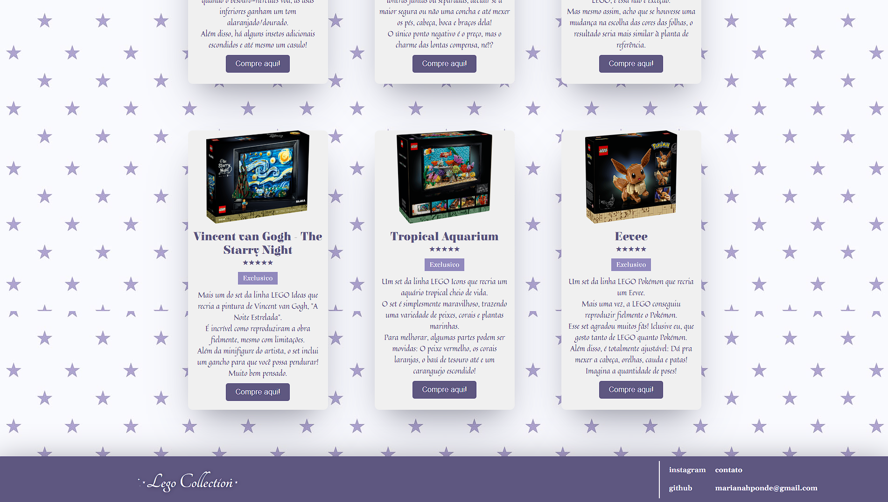
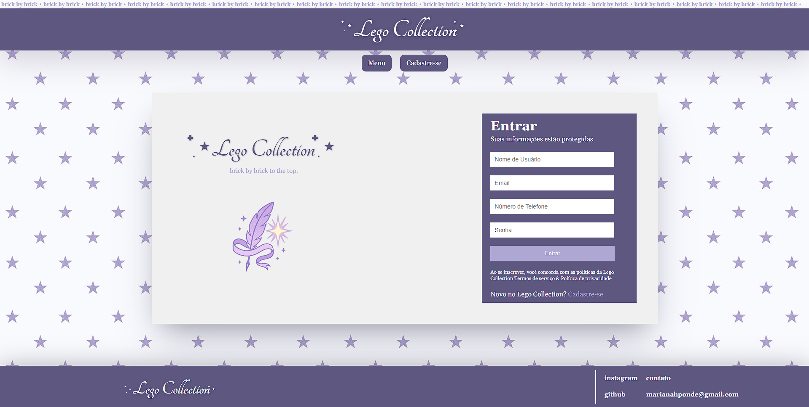
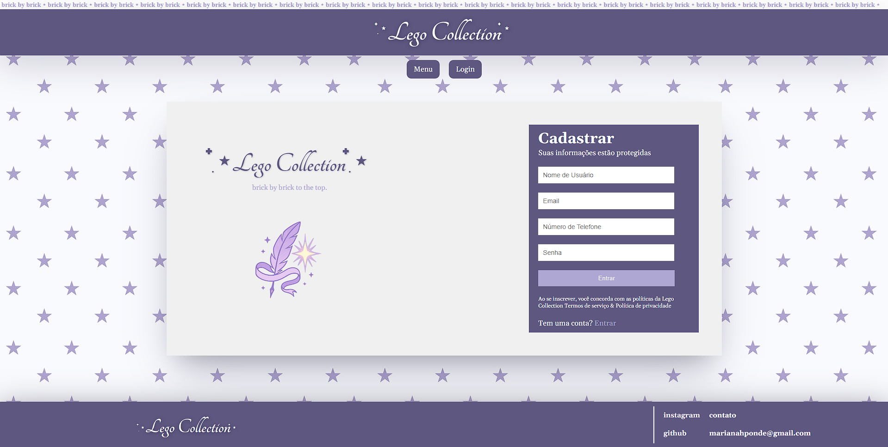

<h1> ⤷ Cartões Interativos </h1>

  
  
  

  <a href="#introducao">Introdução</a> •
  <a href="#demonstracao">Demonstração do Site</a> •
  <a href="#finalizacao">Finalização</a>

---

## ♯ Introdução: 

Este projeto foi desenvolvido como atividade prática de programação front‑end, utilizando HTML e CSS no VsCode.
O objetivo principal foi aplicar conceitos fundamentais de estruturação e estilização de páginas web.

### ⟢ Estrutura do Projeto:

📂 images-README       # imagens utilizadas no README
📂 images              # imagens utilizadas no site
📜 index.html          # página inicial (menu)
📜 login.html          # página de login
📜 cadastro.html       # página de cadastro
📜 style.css           # estilização
📜 README.md           # documentação do projeto

### ⟢ Conceitos de Programação Aplicados:

* Estruturação de conteúdo com tags (div, h1, p, img, a, button)
* Links e navegação (a href=)
* Imagens com atributos (img src= alt=)
* Agrupamento de elementos (div)
* Seletores de classe e elemento (.card, .contato h1, .logo)
* Box model (margin, padding, border, box-sizing)
* Flexbox: display (flex, justify-content, align-items, flex-direction)
* Estilização de texto (font-family, font-size, color, text-align, text-shadow)
* Estilização de botões (background-color, border-radius, cursor, transition, hover)
* Estilização de imagens (object-fit, border-radius)
* Sombras (box-shadow)
* Outros

---

## ♯ Demonstração do Site: 

---

## ♯ Finalização: 

### ⟢ Tecnologias Utilizadas:

[Mariszpon](https://github.com/Mariszpon)
